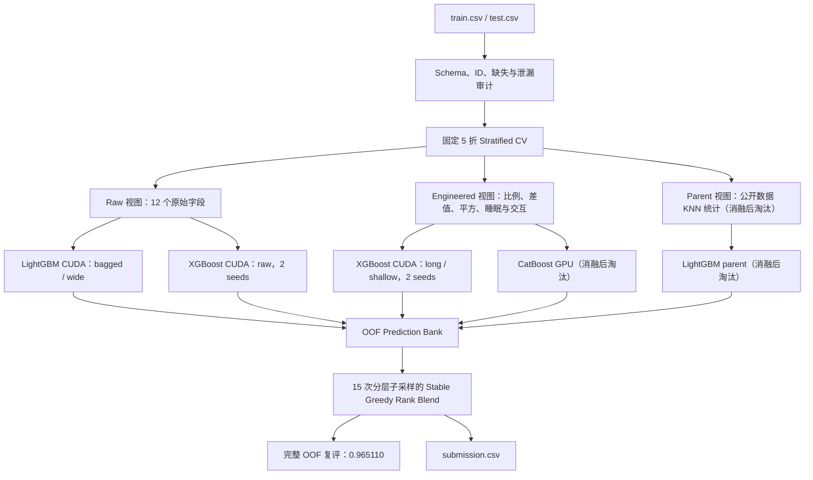

# Playground S6E8 冲榜架构与实验结论

更新时间：2026-08-05

比赛：[Playground Series S6E8 — Predicting Smartphone Addiction](https://www.kaggle.com/competitions/playground-series-s6e8)

## 1. 当前结论

- 最终固定五折 OOF ROC-AUC：**0.965110**。
- 最佳单模：`xgb_engineered_long`，OOF ROC-AUC **0.964710**。
- 相比第一版正式 `lgb_raw_3000` 的 0.963461，最终融合提升 **0.001649**。
- 最终提交文件：`outputs/leaderboard_final/submission.csv`。
- 提交文件共 296,302 行，ID 与 `sample_submission.csv` 顺序完全一致，预测值全部有限。
- 截至本文档更新时间，尚未上传 Kaggle，因此 **没有 Public LB 分数，也不能据此声称具体榜位**。

## 2. 指标是什么意思

比赛指标是 ROC-AUC。它可以理解为：随机抽一个正样本和一个负样本，模型把正样本排在负样本前面的概率。

- 0.5：接近随机排序。
- 1.0：完美排序。
- 当前 OOF 0.965110：在固定五折的样本外预测中，正负样本对约有 96.5% 被正确排序。
- ROC-AUC 主要评价排序，不要求概率经过完美校准，也不需要选择 0.5 之类的分类阈值。
- 因为比赛只看排序，最终采用 rank blend；不同模型先转成百分位排名，再按 OOF 学到的权重融合。

不能只看训练集 AUC。本文所有模型选择都基于同一套固定 `StratifiedKFold(n_splits=5, seed=20260803)` OOF，避免折号变化造成虚假提升。

## 3. 项目最难的部分

### 3.1 大样本下的可信验证

训练集有 691,369 行，测试集有 296,302 行。模型差距常在万分位，如果每次改变折号、抽样或只跑两折，噪声足以覆盖真实增益。核心做法是固定五折、保存每行 OOF、记录每折 AUC 和最佳迭代数。

### 3.2 缺失值本身是数据生成过程的一部分

12 个输入字段均存在缺失。树模型保留原生 NaN 路径，同时添加原始字段缺失指示、行级缺失数量和缺失比例。不能简单删除缺失行，也不能只做一次全局均值填充。

### 3.3 多模型不等于有效融合

CatBoost、父数据 KNN 和若干早期 LightGBM 虽然预测相关性更低，但 OOF 不够强，稳定融合选择频率为 0。最终只保留“足够强且误差有差异”的模型，避免为了模型数量而稀释主模型。

### 3.4 外部父数据可能同字段、不同规则

公开 7,500 行数据与比赛 12 个字段完全对应，但加入 KNN 标签/距离特征后，LightGBM 从 0.963494 降至 0.962558。相同字段并不等于同一生成分布，外部数据必须做 OOF 消融，不能看到“母数据”就直接拼接。

### 3.5 GPU 后端并不统一

当前设备是 RTX 5090 D。CatBoost 使用 `task_type=GPU`，LightGBM 使用 CUDA 构建，XGBoost 使用 `device=cuda, tree_method=hist`。三者参数名、二进制依赖和显存行为不同，必须分别用真实拟合验证，不能只靠 CUDA 可见性判断。

## 4. 最终架构



### 代码分层

| 模块 | 责任 |
|---|---|
| `src/s6e8/data.py` | 加载 train/test/sample、字段校验、固定折号 |
| `src/s6e8/features.py` | raw / engineered / parent 特征视图、统一编码 |
| `src/s6e8/external.py` | 7,500 行公开数据校验、批量近邻统计与磁盘缓存 |
| `src/s6e8/models.py` | CatBoost、LightGBM、XGBoost、ExtraTrees、Logistic 的统一折训练接口 |
| `src/s6e8/training.py` | “实验名 + 基础模型 + 特征视图 + 独立 seed”的 OOF 训练 |
| `src/s6e8/ensemble.py` | OOF 银行、相关矩阵、稳定 rank 权重和提交生成 |
| `src/s6e8/hardware.py` | 三种 GPU 后端的真实小模型拟合检查 |

## 5. 特征视图

### Raw

- 12 个原始输入字段。
- 类别字段 one-hot（CatBoost 路径保留原生类别）。
- 数值缺失保留给 LightGBM/XGBoost 原生缺失分裂。
- 添加每个原始数值字段的缺失指示。

### Engineered

在 Raw 基础上增加：

- 社交、游戏、工作占总屏幕时间的比例。
- 周末与工作日屏幕时间的差值、比例和平方项。
- 已知使用时长、其他屏幕时长、非工作屏幕时长。
- 睡眠缺口、屏幕/睡眠、屏幕/清醒时长。
- 通知/小时、打开/小时、通知/打开及对数变换。
- 压力 × 睡眠缺口、压力 × 屏幕时间、学习影响 × 工作时长。
- 行级数值、类别和总体缺失统计。

### Parent（保留实现，但不进入最终模型）

- 在父数据统计量下标准化数值字段，并对类别字段 one-hot。
- 对每个比赛样本查询 1/3/5/10/25 个近邻。
- 生成近邻标签均值、距离加权标签均值、平均距离、到正负类最近距离和距离差。
- 全量结果缓存于 `data/processed/parent_neighbors_v1.npz`，避免重复查询约 100 万行。

## 6. 正式实验结果

所有结果使用同一固定五折。

| 实验 | 模型 / 视图 | OOF AUC | 耗时（秒） | 结论 |
|---|---|---:|---:|---|
| `lgb_raw_3000` | LightGBM raw | 0.963461 | 619.6 | 首个正式基准，太慢 |
| `lgb_raw_fast` | LightGBM raw | 0.963494 | 312.1 | 学习率提高后更快且略高 |
| `lgb_engineered` | LightGBM engineered | 0.963403 | 247.9 | 单模略降，但早期融合有贡献 |
| `lgb_parent` | LightGBM engineered+parent | 0.962558 | 251.4 | 外部近邻明显降分，淘汰 |
| `cat_engineered` | CatBoost engineered | 0.959160 | 502.8 | 低于主模型，淘汰 |
| `lgb_raw_bagged` | LightGBM raw + 真正行采样 | 0.963785 | 245.3 | 有效架构修正 |
| `lgb_raw_wide` | LightGBM raw + 63 leaves | 0.963775 | 338.2 | 保留作多样性 |
| `xgb_raw` | XGBoost raw | 0.964193 | 67.7 | 强且快 |
| `xgb_raw_seed2` | XGBoost raw seed2 | 0.964207 | 67.9 | 多 seed 降方差 |
| `xgb_engineered` | XGBoost engineered | 0.964586 | 62.4 | 首次超过旧融合 |
| `xgb_engineered_seed2` | XGBoost engineered seed2 | 0.964595 | 62.6 | 小幅正向 |
| `xgb_engineered_long` | XGBoost engineered，2600 trees | **0.964710** | 87.5 | 最佳单模 |
| `xgb_engineered_long_seed2` | 上述配置 seed2 | 0.964687 | 87.1 | 最终融合核心 |
| `xgb_engineered_shallow` | XGBoost engineered，depth=5 | 0.964620 | 64.4 | 低相关结构增益 |

重要发现：早期配置写了 `subsample: 0.85`，但 LightGBM 没有设置 `subsample_freq`，实际没有启用行采样。加入 `subsample_freq: 1` 后，`lgb_raw_bagged` 同时提分和提速。

## 7. 最终融合

方法：先把每个模型预测转成百分位排名，再在 15 次分层子样本（每次最多 120,000 行）上做 greedy blend，平均各轮权重并在完整 691,369 行 OOF 上复评。

| 模型 | 最终权重 | 重采样选择频率 |
|---|---:|---:|
| `xgb_engineered_long` | 0.275873 | 1.0000 |
| `xgb_engineered_long_seed2` | 0.218095 | 0.8667 |
| `xgb_raw_seed2` | 0.183492 | 0.8000 |
| `xgb_engineered_shallow` | 0.133333 | 0.6000 |
| `lgb_raw_wide` | 0.088889 | 0.4667 |
| `xgb_raw` | 0.067937 | 0.3333 |
| `lgb_raw_bagged` | 0.032381 | 0.2000 |

最终完整 OOF AUC：**0.9651103466**。

## 8. 外部数据记录

比赛 Data 页面说明数据受 Smartphone Addiction Prediction Dataset 启发，但原链接当前不可用。项目使用了一个公开、同字段结构的 CC0 副本做消融：

- 来源：[Smartphone Usage and Addiction Prediction](https://www.kaggle.com/datasets/jayjoshi37/smartphone-usage-and-addiction-prediction)
- 文件：`Smartphone_Usage_And_Addiction_Analysis_7500_Rows.csv`
- 行列：7,500 × 16。
- SHA256：`2194CE1946E8559F26780049C8D972857D8378104F2C9EC25ED9EC35409F1074`
- 比赛规则允许满足可公开获取、合理可访问条件的外部数据；实际使用前仍应以当前[比赛规则](https://www.kaggle.com/competitions/playground-series-s6e8/rules)为准。
- 由于 OOF 消融降分，最终配置不使用该数据；保留代码和缓存只为可复现实验结论。

## 9. 一键复现

先检查三套 GPU 后端：

```powershell
powershell -ExecutionPolicy Bypass -File .\run-wsl.ps1 gpu-check
```

训练最终七个实验并融合：

```powershell
powershell -ExecutionPolicy Bypass -File .\run-wsl.ps1 `
  --config configs/leaderboard_final.yaml train

python run.py --config configs/leaderboard_final.yaml blend
```

也可以在 WSL GPU 环境中一次运行完整流程：

```powershell
powershell -ExecutionPolicy Bypass -File .\run-wsl.ps1 `
  --config configs/leaderboard_final.yaml all
```

主要产物：

```text
outputs/leaderboard_final/model_summary.csv
outputs/leaderboard_final/ensemble.json
outputs/leaderboard_final/oof_rank_correlation.csv
outputs/leaderboard_final/oof_ensemble.csv
outputs/leaderboard_final/submission.csv
```

当前提交文件 SHA256：`BE41BA39FF6C095516D561F29216D1C54C3926A424524D80AADF02228B523406`。

## 10. 冲榜下一步

1. 先提交当前文件，确认 Public LB 与固定 OOF 的方向一致。
2. 如果 Public LB 对齐，再增加第三个 XGBoost seed；不再优先扩张 CatBoost 或父数据分支。
3. 只保留能够跨 seed、跨折稳定提升的参数，不根据单次 Public LB 反复拟合。
4. 最终提交应保留一个纯 XGBoost 强单模和一个稳定融合，防止排行榜分布与本地 OOF 有轻微偏移。
