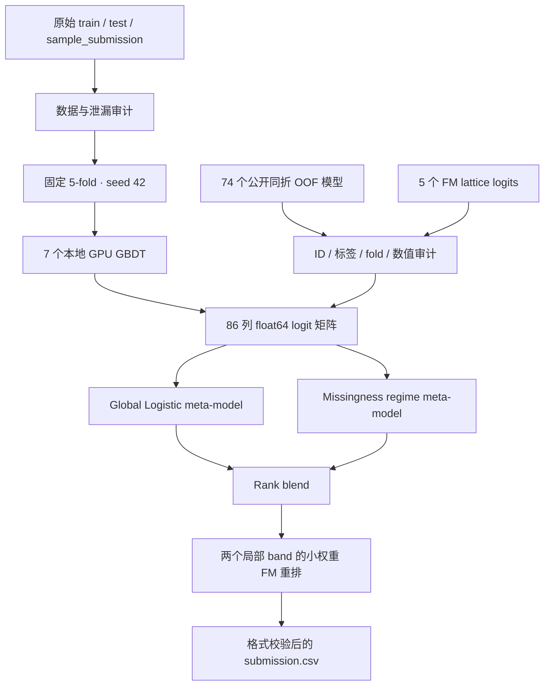

# Kaggle Playground S6E8 冲榜工程

面向 Kaggle [Predicting Smartphone Addiction](https://www.kaggle.com/competitions/playground-series-s6e8) 的 GPU 冲榜工程。任务是根据用户行为特征预测智能手机成瘾概率，官方指标为 **ROC-AUC**。这个仓库不只是一个训练脚本，而是一套从数据审计、固定 OOF、GPU 一级模型、跨架构 stacking、缺失模式专家到提交校验的完整实验系统。

> **当前战绩（2026-08-06）**：Public LB **0.97084**，排名 **42 / 约 770**，约为公开榜 **Top 5.5%**；当时榜一为 **0.97115**，实际差距是 **0.00031**。公开榜只使用约 20% 测试集，最终排名由另外约 80% 的 private 数据决定，因此本项目以固定 OOF 和逐折稳定性作为主要决策依据，而不是只追逐一次 public 分数。

最新方案、完整消融和提交策略见 [LEADERBOARD_V3.md](LEADERBOARD_V3.md)，早期纯本地 GPU GBDT 方案见 [LEADERBOARD_V2.md](LEADERBOARD_V2.md)。

## 项目概览

| 项目 | 当前实现 |
|---|---|
| 任务 | 二分类，预测 `addicted_label` 的概率 |
| 数据规模 | 691,369 行训练数据，296,302 行测试数据 |
| 官方指标 | ROC-AUC，只关心正负样本的排序质量 |
| 本地验证 | 固定 `StratifiedKFold(5, shuffle=True, random_state=42)` OOF |
| 训练设备 | WSL2 + NVIDIA GeForce RTX 5090 D；XGBoost、LightGBM、CatBoost GPU 链路 |
| 纯本地 GBDT OOF | 0.965110 |
| 当前最强 OOF | **0.969750802**，86 个一级预测 + 缺失模式 meta + band 后处理 |
| 当前 Public LB | **0.97084，Rank 42，Top 5.5%**（2026-08-06 快照） |
| 主候选 | `outputs/leaderboard_v3_combined/submission.csv` |
| 稳健候选 | `outputs/leaderboard_v3_fm/submission.csv` |

## 我完成了什么

1. **建立数据审计链路**：检查字段、ID、重复样本、标签冲突、精确匹配、缺失率、单变量异常 AUC 和 train/test 对抗验证，先排除泄漏与分布错位。
2. **固定可比较的 OOF**：所有核心实验统一使用 5 折、seed 42；每个模型同时保存 OOF、test prediction、逐折指标、特征重要性和配置快照，避免不同划分之间错误比较。
3. **打通当前设备 GPU**：在 WSL2 中验证 CatBoost GPU、LightGBM CUDA，并使用 XGBoost GPU 训练多 seed、多深度、raw/engineered 两类特征视图，缩短大样本迭代时间。
4. **构建多架构一级模型池**：除本地 7 个 GPU GBDT 外，严格对齐并审计 74 组公开同折 OOF，以及 5 个低相关 Factorization Machine lattice logits；所有外部预测都核验 ID、标签、长度、数值范围和许可。
5. **实现二层 stacking**：将一级概率转换为 float64 logits，分别训练全局 Logistic Regression meta-model 和带缺失数量、模型分歧、完整行/严重缺失行交互的 regime meta-model。
6. **实现保守后处理**：按 OOF 选择 `1/3 global rank + 2/3 regime rank`，只在两个验证有效的屏幕时长区间内加入小权重 FM 重排，不做无验证依据的测试集手调。
7. **建立提交安全检查**：自动保证 296,302 行、列顺序为 `id,addicted_label`、ID 与 test 逐行一致、预测有限且位于 `[0, 1]`。
8. **形成可复现实验记录**：保存配置、权重、OOF 相关性、分桶指标、模型消融、提交哈希与运行命令，并用自动化测试覆盖关键链路。

## 为什么这样做

- **ROC-AUC 衡量排序，不衡量固定阈值准确率**：因此融合阶段优先使用 logit 与 rank，提交连续概率，不把结果硬切成 0/1。
- **榜单差距已经进入万分位**：继续微调同类 GBDT 的边际收益很小；低相关模型族和不同错误结构，比单模型再加几百棵树更有价值。
- **数据存在明显缺失模式差异**：完整行、缺失 1–3 项和缺失 4 项以上的可预测性不同，因此让 meta-model 显式感知缺失 regime，而不是强迫一套权重覆盖所有样本。
- **public leaderboard 只有约 20% 测试数据**：小数点后第四、第五位很容易受抽样噪声影响，所以最终候选必须同时满足 pooled OOF 提升、5 折大多同向和测试预测稳定。
- **外部 OOF 只有在同折且严格对齐时才可信**：不同 fold 的 OOF 直接混合会让二层模型看到不一致的误差分布，因此所有来源都按 seed 42 的同一折方案审计。

## 当前架构



## 当前水平与判断

| 阶段 | OOF / LB AUC | 说明 |
|---|---:|---|
| 最强本地单模型 | 0.964710 | XGBoost engineered long |
| 本地 7 模型稳定 rank blend | 0.965110 | 纯自研 GPU GBDT 基线 |
| 公开库最佳单模型 | 0.968815 | `naji05` |
| 74 模型 global stack | 0.969660 | 强公开 OOF 基准 |
| 74 + 5 FM + regime + band | 0.969747 | 更稳健的 79 模型候选 |
| 74 + 5 FM + 7 本地 GBDT + regime + band | **0.969751** | 当前最佳本地 OOF |
| Kaggle Public LB | **0.97084** | 2026-08-06：Rank 42 / 约 770 |

目前属于**有竞争力的 Top 5% 冲榜方案**，已经进入头部高密度分数区，但还不是榜一。与当时第一名 `0.97115` 的差距只有 `0.00031`，不是 `0.05`；在这个阶段，增加相似树模型通常只能带来百万分位到十万分位的变化。更重要的是最终 80% private leaderboard 尚不可见，因此 `0.97084` 只能说明当前 public 表现强，不能保证最终名次。

## 当前方案如何运行

先将官方 `train.csv`、`test.csv`、`sample_submission.csv` 放入 `data/raw/`，安装 `requirements.txt`，并按 [LEADERBOARD_V3.md](LEADERBOARD_V3.md#数据与许可) 下载和解压两个 CC0 外部预测源：74 模型 OOF 库与 FM lattice 库。外部文件不会提交到 Git。

```powershell
# 1. 确认 WSL2 中 CatBoost GPU 和 LightGBM CUDA 可用
.\run-wsl.ps1 gpu-check

# 2. 在固定 5-fold / seed 42 上训练 7 个本地 GPU GBDT 一级模型
.\run-wsl.ps1 --config configs/leaderboard_v3_seed42.yaml train

# 3. 生成 79 模型稳健候选（74 public + 5 FM）
.\.venv\Scripts\python.exe run.py `
  --config configs\leaderboard_v3_fm.yaml stack-public

# 4. 生成 86 模型主候选（再加入 7 个本地 GPU GBDT）
.\.venv\Scripts\python.exe run.py `
  --config configs\leaderboard_v3_combined.yaml stack-public

# 5. 运行关键链路测试
.\.venv\Scripts\python.exe -m unittest discover -s tests -p "test_*.py" -v
```

主要输出：

```text
outputs/leaderboard_v3_combined/public_stack.json       # 最终 OOF、分桶与选择原因
outputs/leaderboard_v3_combined/global_meta_weights.csv # 全局 meta 权重
outputs/leaderboard_v3_combined/regime_meta_weights.csv # 缺失模式 meta 权重
outputs/leaderboard_v3_combined/submission.csv          # 当前主提交
outputs/leaderboard_v3_fm/submission.csv                # private 风险更低的稳健候选
```

## 当前能力

- 数据、泄漏、重复行、缺失值和分布偏移审计；
- 固定五折 OOF 训练与逐折稳定性分析；
- XGBoost、LightGBM、CatBoost GPU 训练；
- raw/engineered、多 seed、多深度模型消融；
- greedy rank ensemble、全局 LR stack 和缺失模式 regime stack；
- 公开 OOF、FM logits 与本地预测的严格对齐接入；
- 分桶后处理、权重导出、预测相关性与 SHA-256 记录；
- Kaggle 提交格式自动生成与校验；
- 单元测试和 GPU smoke test。

## 目录

```text
kaggle-s6e8/
├─ configs/                  # CPU/GPU、V2、V3 与消融配置
├─ data/raw/                 # Kaggle CSV，不提交到 Git
├─ data/external/            # 公开 OOF / FM 数据，不提交到 Git
├─ outputs/                  # OOF、权重、指标与 submission，不提交到 Git
├─ src/s6e8/                 # 审计、训练、融合、stacking 主代码
├─ tests/                    # 关键链路测试
├─ LEADERBOARD_V2.md         # 纯本地 GPU GBDT 阶段
├─ LEADERBOARD_V3.md         # 当前冲榜架构、消融和提交策略
├─ requirements.txt
├─ run-wsl.ps1
└─ run.py
```

## 1. 准备环境

建议使用 Python 3.10–3.13：

```powershell
cd C:\Users\mie\Documents\dice\kaggle-s6e8
py -3.12 -m venv .venv
.\.venv\Scripts\Activate.ps1
python -m pip install --upgrade pip
python -m pip install -r requirements.txt
```

如果暂时不安装 CatBoost 和 LightGBM，审计、ExtraTrees、Logistic 与融合仍然可以运行；配置中的 `skip_missing_models: true` 会跳过缺失模型。

### 当前设备的 WSL2 GPU 环境

当前机器已完成并验证以下环境：

- GPU：NVIDIA GeForce RTX 5090 D，约 32 GB 显存；
- WSL：Ubuntu 22.04；
- Python：`/home/lsc/.venvs/kaggle-s6e8/bin/python`；
- CatBoost 1.2.10：`task_type=GPU`，设备 `0`；
- LightGBM 4.7.0：使用 CUDA 12.9、SM 120 和兼容 Ubuntu 22.04 的 NCCL 编译，`device_type=cuda`；
- `configs/base.yaml` 继续保留 CPU 配置，`configs/gpu_wsl.yaml` 是正式 GPU 配置。

先验证两个模型确实能使用 GPU：

```powershell
cd C:\Users\mie\Documents\dice\kaggle-s6e8
powershell -ExecutionPolicy Bypass -File .\run-wsl.ps1 gpu-check
```

返回 `"status": "ok"`，且同时显示 CatBoost 的 `GPU` 和 LightGBM 的 `cuda` 才算通过。正式五折训练：

```powershell
powershell -ExecutionPolicy Bypass -File .\run-wsl.ps1 `
  --output-dir outputs/gpu_baseline_v1 `
  all --models catboost lightgbm --adversarial
```

快速复验完整真实数据链路可使用两折短配置：

```powershell
powershell -ExecutionPolicy Bypass -File .\run-wsl.ps1 `
  --config configs/gpu_smoke.yaml train --models catboost lightgbm
powershell -ExecutionPolicy Bypass -File .\run-wsl.ps1 `
  --config configs/gpu_smoke.yaml blend
```

`gpu_smoke` 只用于检查训练链路和速度，不应用它代替固定五折冲榜结果。LightGBM CUDA 只支持 Linux 构建，编译方式参考其[官方安装指南](https://lightgbm.readthedocs.io/en/stable/Installation-Guide.html)。

## 2. 放入比赛数据

将文件放到：

```text
data/raw/train.csv
data/raw/test.csv
data/raw/sample_submission.csv
```

不要改 CSV 行顺序。程序会验证 sample submission 的 ID 是否与 test 一致。

## 3. 第一轮：数据审计

```powershell
python run.py --output-dir outputs/audit_v1 audit --adversarial
```

重点查看：

```text
outputs/audit_v1/audit_summary.json
outputs/audit_v1/audit_univariate_auc.csv
outputs/audit_v1/folds.csv
```

优先回答：

1. 屏幕、社交和周末使用时间的单变量 AUC 是否与完整模型一致；
2. 是否有重复行和标签冲突；
3. 测试集是否有行能在训练集中精确找到；
4. adversarial validation AUC 是否明显高于 0.5；
5. 各字段缺失率的 train/test 差异是否影响验证；
6. `id` 是否值得保留。

## 4. 第一轮模型

先跑强模型和一个线性多样性模型：

```powershell
python run.py --output-dir outputs/baseline_v1 train --models catboost lightgbm logistic
python run.py --output-dir outputs/baseline_v1 blend
```

一条命令跑完整流程：

```powershell
python run.py --output-dir outputs/baseline_v1 all --models catboost lightgbm logistic --adversarial
```

最终提交文件：

```text
outputs/baseline_v1/submission.csv
```

融合诊断文件：

```text
outputs/baseline_v1/ensemble.json
outputs/baseline_v1/oof_rank_correlation.csv
```

## 5. 必做消融实验

### 实验 A：保留全部字段

```powershell
python run.py --output-dir outputs/all_features all --models catboost lightgbm logistic
```

### 实验 B：删除弱类别字段

```powershell
python run.py --output-dir outputs/no_weak_categories --drop-columns gender,stress_level,academic_work_impact all --models catboost lightgbm logistic
```

### 实验 C：加入 ID

```powershell
python run.py --output-dir outputs/with_id --use-id all --models catboost lightgbm logistic
```

### 实验 D：关闭人工特征

```powershell
python run.py --output-dir outputs/raw_features --no-engineered all --models catboost lightgbm logistic
```

只比较统一折号下的 OOF AUC，同时观察各模型预测相关性和融合收益。不要依据一次公开榜结果修改验证结论。

## 6. 快速自检

生成模拟比赛数据：

```powershell
python run.py demo-data --rows 1400 --test-rows 500
python run.py --output-dir outputs/demo all --models extra_trees logistic
```

运行单元测试：

```powershell
python -m unittest discover -s tests -v
```

模拟数据只用于验证代码，不可用于比赛提交。使用真实数据前应删除或覆盖 `data/raw` 中的模拟 CSV。

## 7. 冲榜迭代顺序

1. 锁定固定 OOF，完成泄漏、重复行和分布审计；
2. 建立 CatBoost、LightGBM、Logistic 三个基线；
3. 做弱类别字段、`id`、缺失特征和人工特征消融；
4. 获取并核对疑似 7,500 行公开母数据；
5. 增加母数据最近邻、精确匹配和规则模型；
6. 扩展多 seed、模型参数和低相关模型；
7. 用 OOF greedy rank blend 选择组合；
8. 最后才参考公开榜判断本地验证与测试集是否一致。

详细的问题分析见上级目录的 `Kaggle_S6E8_项目难点与核心.md`，实验台账见 `EXPERIMENTS.md`。
